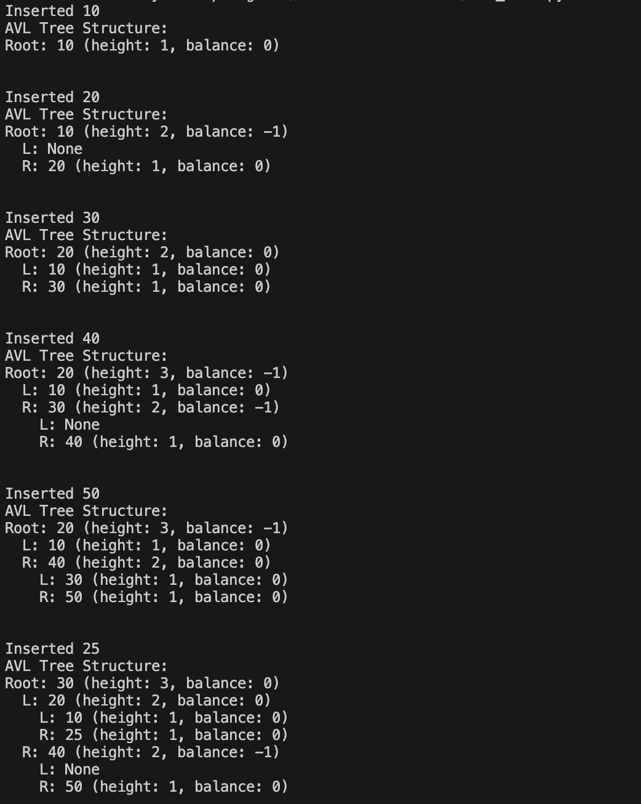
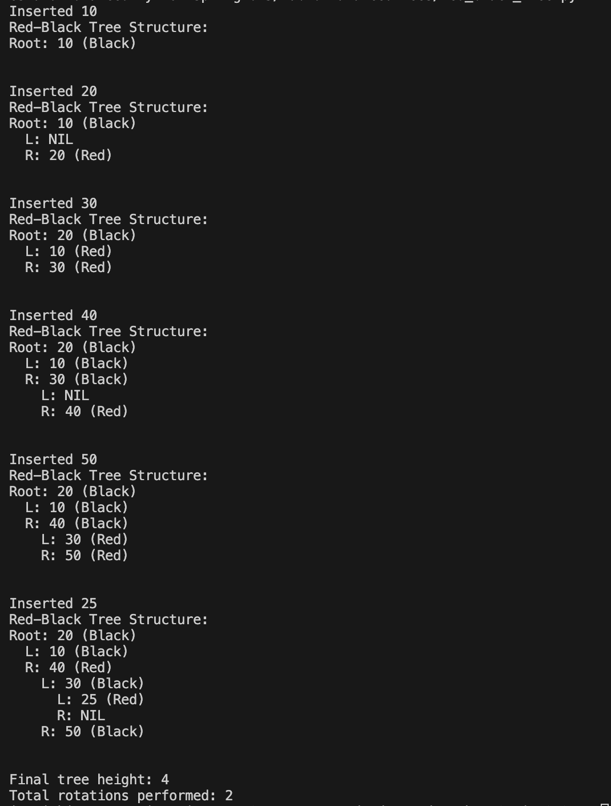
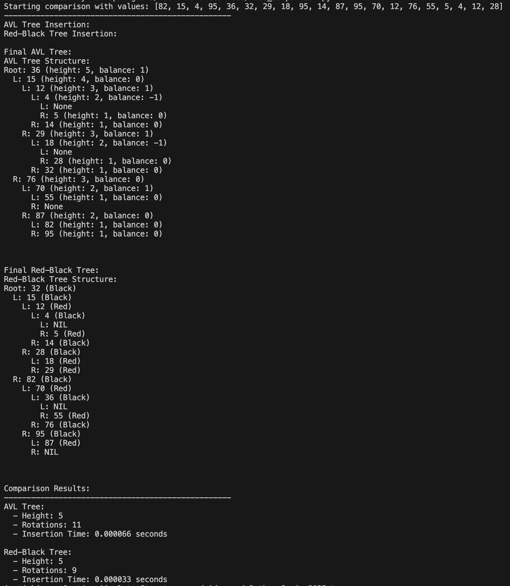

# Lab 10: Balanced Trees

This lab explores the implementation and comparison of two self-balancing binary search tree data structures:
- AVL Trees
- Red-Black Trees

## Project Structure

- `avl_tree.py`: Implementation of an AVL Tree
- `red_black_tree.py`: Implementation of a Red-Black Tree
- `tree_comparison.py`: Script to compare the performance of both tree implementations
- `screenshots/`: Directory containing output screenshots

## Outputs

### AVL Tree Implementation

- Shows the insertion process and final structure of the AVL Tree with test values

### Red-Black Tree Implementation

- Shows the insertion process and final structure of the Red-Black Tree with test values

### Performance Comparison

- Shows the comparison between both tree implementations with 20 random integers

## AVL Tree Implementation

The AVL Tree is implemented with the following features:
- Automatic balancing via rotations (left, right)
- Balance factor calculation
- Height tracking
- Tree visualization

Real-life application: Managing player rankings in a competitive video game leaderboard.

## Red-Black Tree Implementation

The Red-Black Tree is implemented with the following features:
- Color-based balancing (red and black nodes)
- Rotations and recoloring operations
- Tree visualization

Real-life application: Storing and updating book ISBN numbers in a library database.

## Comparison Results

When inserting the same 20 random integers into both trees, we observed the following:

| Metric | AVL Tree | Red-Black Tree |
|--------|----------|---------------|
| Final Height | 5 | 5 |
| Rotations | 11 | 9 |
| Insertion Time | 0.000066 seconds | 0.000033 seconds |

### Key Observations:
- Both trees achieved the same final height (5) with our test dataset
- The AVL Tree required more rotations (11) compared to the Red-Black Tree (9)
- The Red-Black Tree had slightly faster insertion time (0.000033 seconds vs 0.000066 seconds)
- AVL Trees maintain a stricter balance, but at the cost of more rotations
- Red-Black Trees are more efficient for insertion operations while still providing good search performance

## Conclusions

- AVL Trees maintain a stricter balance, resulting in a potentially shorter height
- Red-Black Trees typically require fewer rotations for balancing
- AVL Trees may be more efficient for lookup-heavy operations
- Red-Black Trees may be more efficient for insertion/deletion-heavy operations