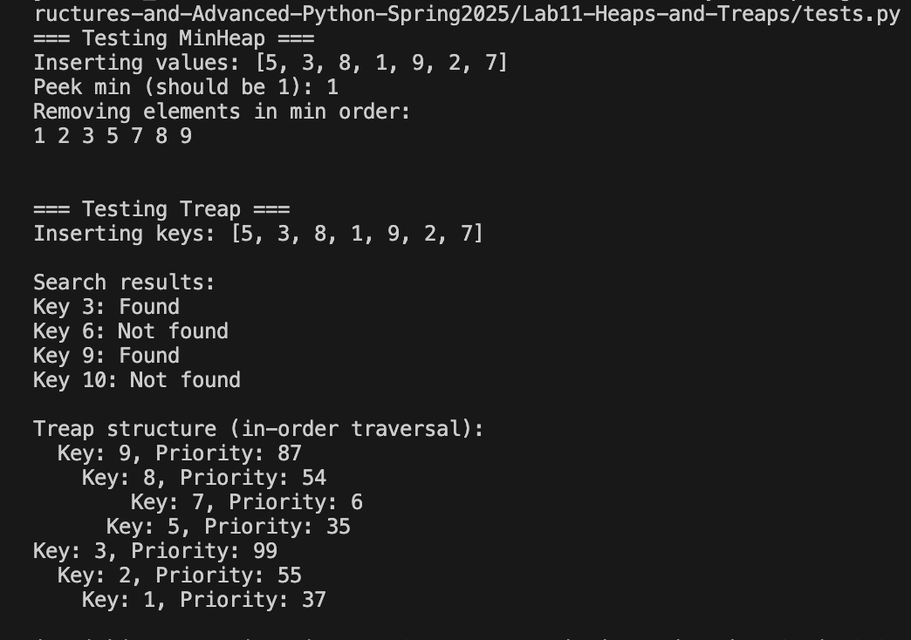

# Lab 11: Heaps and Treaps

Implementation of Binary Min-Heap and Treap data structures in Python.

## Overview

This lab implements two advanced data structures:
- **Binary Min-Heap**: Using Python's `heapq` module for efficient priority queue operations
- **Treap**: A randomized binary search tree combining BST and heap properties

## Files

| File | Description |
|------|-------------|
| `min_heap.py` | Implementation of Binary Min-Heap using heapq |
| `treap.py` | Implementation of Treap with manual rotation logic |
| `tests.py` | Test cases for both data structures |
| `design.pdf` | Design document with pseudocode and data representation |
| `reflection.docx` | Analysis of how heaps and treaps maintain their properties |

## Output Screenshot



## Key Features

### MinHeap
- Insert operation with automatic heap property maintenance
- Remove minimum element efficiently
- Peek at minimum without removal
- O(log n) insertion and deletion

### Treap
- BST insertion with random priorities
- Automatic balancing through rotations
- Expected O(log n) height
- Combines deterministic search with probabilistic balancing

## Implementation Details

### MinHeap Operations
```python
heap.insert(item)      # Add element to heap
heap.remove_min()      # Remove and return smallest element
heap.peek_min()        # View smallest element without removal
```

### Treap Operations
```python
treap.insert_key(key)  # Insert key with random priority
treap.search_key(key)  # Search for key in treap
```

## Performance

| Operation | MinHeap | Treap |
|-----------|---------|--------|
| Insert | O(log n) | O(log n) expected |
| Search | O(n) | O(log n) expected |
| Delete Min/Max | O(log n) | O(log n) expected |
| Peek Min/Max | O(1) | O(log n) expected |

## Learning Objectives

- Understand heap percolation mechanism
- Implement randomized data structures
- Compare performance characteristics
- Practice tree rotations and BST operations

## Group 14

**Ju Ho Kim, Sangmin Kim**  
CS 034 - Data Structures and Advanced Python  
Spring 2025