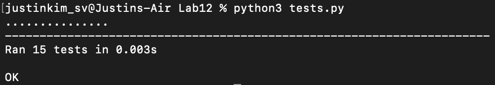
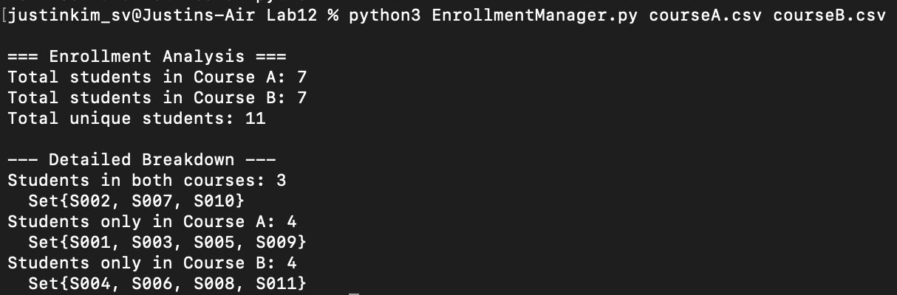

# Lab 12: Implementing and Applying the Set ADT

Implementation of a Set abstract data type and its application to a Course Enrollment Manager.

## Overview

This lab implements:
- **Set ADT**: A custom implementation of the Set data structure
- **Enrollment Manager**: An application that uses Sets to track and analyze student course enrollments
- **Set Operations**: Implementation of union, intersection, and difference operations

## Output Screenshots

### Test Results
All tests pass successfully, validating the correctness of our Set implementation:



### Enrollment Manager Output
The Enrollment Manager correctly analyzes student data across courses:



## Files

| File | Description |
|------|-------------|
| `Set.py` | Implementation of the Set ADT |
| `EnrollmentManager.py` | Course enrollment management using Sets |
| `courseA.csv` | Sample data for Course A enrollments |
| `courseB.csv` | Sample data for Course B enrollments |
| `tests.py` | Unit tests for the Set implementation |
| `design.md` | Design document with class diagrams and pseudocode |

## Usage

```bash
# Run the enrollment manager
python EnrollmentManager.py courseA.csv courseB.csv

# Run the tests
python -m unittest tests.py
```

## Key Features

### Set ADT
- **add(element)**: Add an element to the set
- **remove(element)**: Remove an element from the set
- **contains(element)**: Check if an element exists in the set
- **union(otherSet)**: Combine two sets
- **intersection(otherSet)**: Find common elements between sets
- **difference(otherSet)**: Find elements in first set but not in second

### Enrollment Manager
- Loads course rosters from CSV files
- Computes:
  - Students in both courses
  - Students only in course A
  - Students only in course B
  - All students in either course

## Implementation Details

### Set Operations
```python
set_a.add(student_id)                       # Add a student to the set
set_a.contains(student_id)                  # Check if student is in the set
both_courses = set_a.intersection(set_b)    # Students in both courses
```

## Performance

| Operation | Time Complexity | Space Complexity |
|-----------|-----------------|------------------|
| Add | O(1) average | O(n) |
| Remove | O(1) average | O(1) |
| Contains | O(1) average | O(1) |
| Union | O(n+m) | O(n+m) |
| Intersection | O(min(n,m)) | O(min(n,m)) |
| Difference | O(n) | O(n) |

## Learning Objectives

- Understand Set ADT principles and operations
- Implement concrete Set class using underlying data structures
- Apply Set operations to solve real-world problems
- Practice file I/O and data processing

## Author

**Group 14 (Ju Ho Kim, Sangmin Kim)**  
CS 034 - Data Structures and Advanced Python  
Spring 2025