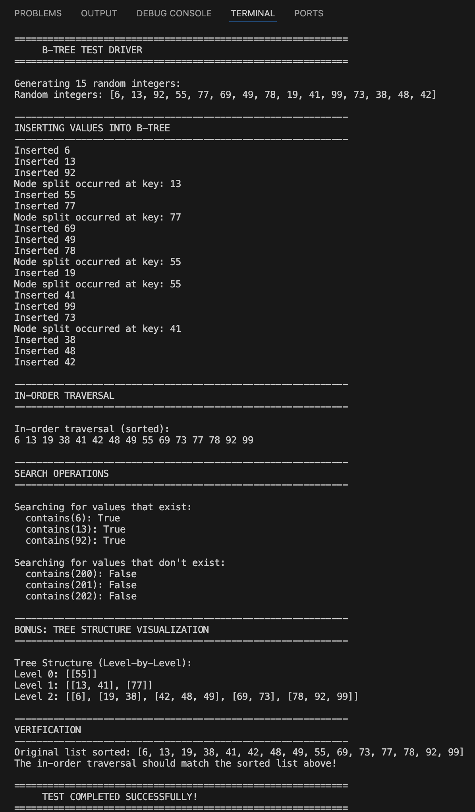

# Lab 15: B-Trees (The last one for this semester!!)

Implementation of a 2-3-4 Tree (B-Tree) data structure from scratch with core functionalities and balancing logic.

## Overview

This lab implements a B-Tree that:
- Supports dynamic node splitting for self-balancing
- Maintains up to 3 keys per node and 2-4 children
- Provides efficient insertion and search operations
- Performs in-order traversal to display sorted keys
- (Bonus) Includes remove operation and visual tree display

## Output Screenshot



## Files

| File | Description |
|------|-------------|
| `btree.py` | B-Tree implementation with Node class |
| `test_driver.py` | Test program with 15-20 random integers |
| `output.txt` | Sample output from test runs |
| `tree_visual.txt` | (Bonus) Visual tree representation |
| `README.md` | This file |

## Usage

1. Run the test driver:
```bash
python test_driver.py
```
2. View the random integers being inserted
3. See the in-order traversal (sorted output)
4. Check search results for various keys
5. (Bonus) View the visual tree structure

## Implementation Details

### Node Structure
- Keys: List containing 1-3 integer keys
- Children: List containing 2-4 child node references
- Leaf flag: Boolean indicating if node is a leaf

### Core Methods
- **insert(key)**: Add key with automatic node splitting
- **contains(key)**: Search for key using tree traversal
- **inOrderTraversal()**: Print all keys in sorted order
- **remove(key)**: (Bonus) Delete key with rebalancing

## Algorithm Details

- **Node Splitting**: When node has 3 keys, split into two nodes and promote middle key
- **Search Strategy**: Compare with keys in node, traverse appropriate child
- **Tree Height**: Maintained at O(log n) through automatic balancing
- **In-Order Traversal**: Recursive traversal visiting left subtree, node, right subtree

## Implementation Notes

- Simple loop structures using while loops with explicit increments
- Detailed step-by-step comments explaining each operation
- Clear variable names and explicit conditionals
- No advanced Python features to ensure readability

## Example Output

```
Inserting random integers: [45, 23, 67, 12, 89, 34, 56, 78, 90, 11, 22, 33, 44, 55, 66]

Building B-Tree...
Node split occurred at key: 34
Node split occurred at key: 56

In-order traversal (sorted):
11 12 22 23 33 34 44 45 55 56 66 67 78 89 90

Search Results:
contains(45): True
contains(100): False

Tree Structure (Level-by-Level):
Level 0: [34, 56]
Level 1: [12, 23] [45] [67, 78, 89]
Level 2: [11] [22] [33] [44] [55] [66] [90]
```

## Author

**Group 14 (Ju Ho Kim, Sangmin Kim)**  
CS 034 - Data Structures and Advanced Python  
Spring 2025

### Individual Contributions

**Ju Ho Kim:**
- Implemented the Node class structure and `is_full()` method
- Developed the `insert()` and `_insert_non_full()` methods
- Created the test driver program with random integer generation
- Wrote documentation and README file

**Sangmin Kim:**
- Implemented the `_split_child()` method for node splitting logic
- Developed the `contains()` and `_search()` methods
- Implemented the `inOrderTraversal()` and `_in_order_helper()` methods
- Created the bonus `print_tree()` visualization method

### Collaborative Work
- Design discussions and algorithm planning
- Testing and debugging of all methods
- Code review