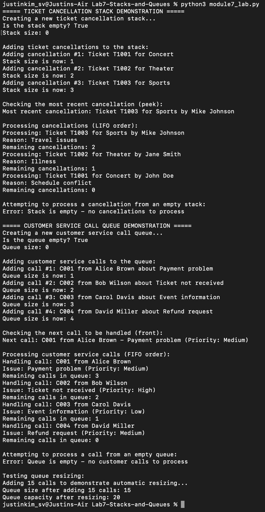

# Lab 7: Implementing Stacks and Queues

This is the Week 7 of the course.
Lab 7 is about implementing Stack and Queue data structures for a ticketing service company.

## Project Description

The lab is divided into two parts:

### Part A: Stack Scenario (Ticket Cancellation Management)
- Implementation of a Stack using a linked list
- Manages ticket cancellations following the Last-In-First-Out (LIFO) principle
- Includes methods: `push()`, `pop()`, `peek()`, `is_empty()`, and `get_size()`

### Part B: Queue Scenario (Customer Service Call Handling)
- Implementation of a Queue using an array
- Manages customer service calls following the First-In-First-Out (FIFO) principle
- Includes methods: `enqueue()`, `dequeue()`, `front()`, `is_empty()`, and `get_size()`
- Features dynamic array resizing

## Key Features
- Proper edge case handling
- Comprehensive error management
- Detailed documentation
- Example usage demonstrating functionality

## Run Results

