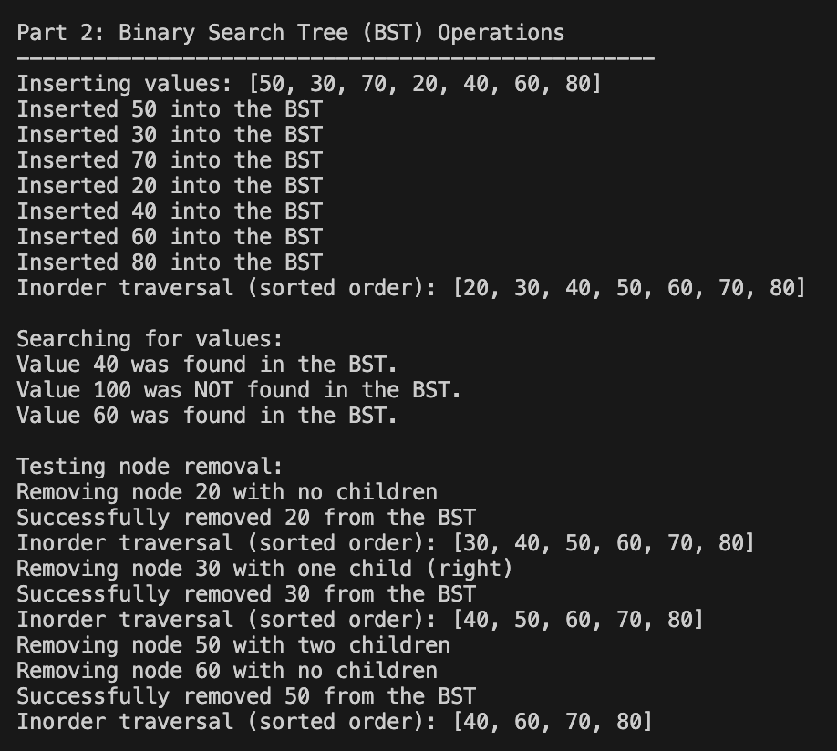

# Lab 9: Trees Implementation

- **Author:** Ju Ho Kim, Sangmin Kim
- **Course:** CS 034 - Data Structures and Advanced Python  
- **Date:** April 27, 2025

## Overview
This lab implements binary trees, binary search trees (BST), and AVL trees with various operations and traversal methods.

## Features
- Binary tree implementation with Node class
- Recursive traversal methods: preorder, inorder, and postorder
- Binary Search Tree (BST) with insert, search, and remove operations
- AVL Tree implementation with self-balancing capabilities (Extra Credit)

## Implementation Details

### Part 1: Binary Tree Construction & Traversals
- Created a binary tree with the structure:

    A
   / \
  B   C
 / \   \
D   E   F
- Implemented three traversal methods:
- Preorder traversal (Root -> Left -> Right)
- Inorder traversal (Left -> Root -> Right)
- Postorder traversal (Left -> Right -> Root)

### Part 2: Binary Search Tree (BST) Operations
- Implemented a Binary Search Tree with the following operations:
- `insert(value)`: Adds a new value to the BST
- `search(value)`: Looks for a value in the BST
- `remove(value)`: Removes a value from the BST, handling all three cases
- `inorder()`: Traverses the BST in sorted order

### Part 3: AVL Tree Implementation (Extra Credit)
- Implemented an AVL Tree that automatically balances itself after insertions
- Added balance factor tracking and rotation operations:
- Left-Left (LL) Rotation
- Right-Right (RR) Rotation
- Left-Right (LR) Rotation
- Right-Left (RL) Rotation

## Outputs

### Binary Tree Traversals

### BST Operations

### AVL Tree Balancing
