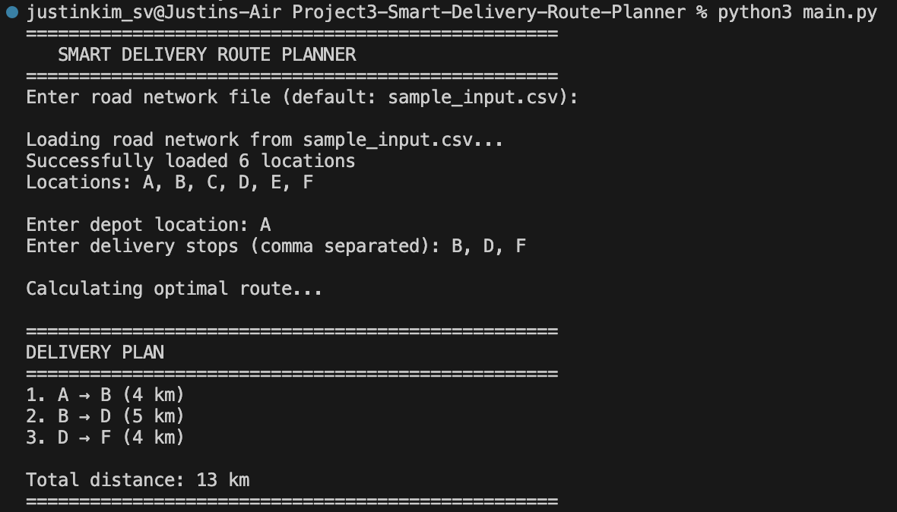

# Project 3: Smart Delivery Route Planner

Implementation of a delivery route optimization system using graph algorithms.

## Overview

This project implements a logistics route planner that:
- Builds a road network graph from CSV data
- Checks route connectivity using Depth-First Search (DFS)
- Finds shortest paths using Dijkstra's algorithm
- Plans optimal delivery routes using a greedy nearest-neighbor approach

## Output Screenshot



## Files

| File | Description |
|------|-------------|
| `main.py` | Main program interface for route planning |
| `graph_utils.py` | Graph construction and pathfinding algorithms |
| `sample_input.csv` | Example road network data |
| `design_doc.md` | Design document with pseudocode |
| `README.md` | This file |

## Usage

1. Run the main program:
```bash
python main.py
```
2. Enter the road network file (or press Enter for default)
3. Enter your depot location (e.g., A)
4. Enter delivery locations separated by commas (e.g., B, D, F)
5. View the optimal delivery route and total distance

## Sample Input Format

The CSV file should have three columns:
```csv
source,destination,distance
A,B,4
B,C,3
```

## Algorithm Details

- **Graph Representation**: Adjacency list using dictionaries
- **Route Checking**: DFS implementation
- **Shortest Path**: Dijkstra's algorithm with priority queue
- **Route Planning**: Greedy nearest-neighbor heuristic

## Example Output

```
Enter depot location: A
Enter delivery stops (comma separated): B, D, F

DELIVERY PLAN
==================================================
1. A → B (4 km)
2. B → D (5 km)
3. D → F (4 km)

Total distance: 13 km
==================================================
```

## Author

**Group 14 (Ju Ho Kim, Sangmin Kim)**  
CS 034 - Data Structures and Advanced Python  
Spring 2025